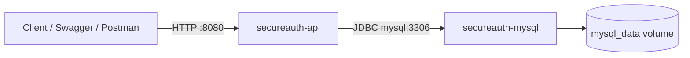

# Docker Guide

This guide explains how to run **SecureAuthAPI + MySQL** locally with Docker Compose.

## Prerequisites
- Docker 20.10+
- Docker Compose v2

## Services
- `app` (`secureauth-api`): Spring Boot API on `http://localhost:8080`
- `mysql` (`secureauth-mysql`): MySQL 8.0 exposed on host `localhost:3307` 
- `mysql_data` volume: persistent MySQL data

## Container Architecture


## Setup
1. Create local environment file:
   ```bash
   cp .env.example .env
   ```
2. Review and update required values in `.env`:
   - `DB_PASSWORD`
   - `JWT_SECRET`
   - Optional tuning (e.g. `SPRING_JPA_DDL_AUTO`, rate limits)

## Port Configuration

### MySQL Port: 3307 (Host) → 3306 (Container)
By default, MySQL is exposed on host port 3307 instead of the standard 3306.

**Why?**
- Avoids conflicts with local MySQL instances running on port 3306
- Allows running Docker containers alongside local MySQL without shutting down either
- Useful if you use local MySQL for other projects

**Access:**
- From host machine: `mysql -h 127.0.0.1 -P 3307 -u root -p`
- From Spring Boot app (inside container): `mysql:3306` (internal network)

**Customize:**
If you need a different port, edit `docker-compose.yml`:
```yaml
mysql:
  ports:
    - "3307:3306"  # Change 3307 to your preferred port
```

## Start
```bash
docker compose up --build -d
```

Check status:
```bash
docker compose ps
```

Follow logs:
```bash
docker compose logs -f app
docker compose logs -f mysql
```

## Stop / Restart
Stop containers:
```bash
docker compose down
```

Restart services:
```bash
docker compose restart
```

Recreate after `.env` changes:
```bash
docker compose up -d --force-recreate
```

## Data Persistence
MySQL data is stored in the named volume `mysql_data`.  
Data survives `docker compose down` and `docker compose up` as long as you do **not** use `-v`.

Remove everything including database data:
```bash
docker compose down -v
```

## Quick Verification
Health endpoint:
```bash
curl http://localhost:8080/actuator/health
```

API login endpoint (example):
```bash
curl -X POST http://localhost:8080/api/auth/login \
  -H "Content-Type: application/json" \
  -d "{\"email\":\"user@example.com\",\"password\":\"SecurePass123!\"}"
```

## Admin User Setup
After first login, you can promote a user to ADMIN role via MySQL Workbench or CLI:
```bash
docker exec -it secureauth-mysql mysql -u root -p$DB_PASSWORD db_secure_auth \
  -e "UPDATE users SET role='ADMIN' WHERE email='your_email@example.com';"
```
Then login again in Postman to get a fresh ADMIN token.

## Common Issues (Troubleshooting)
### 1. Port conflict (`8080` or `3307`)
Another process is already using the port.

Fix:
- Stop the conflicting process, or
- Change host port mappings in `docker-compose.yml`.

### 2. App starts but DB connection fails
MySQL may still be initializing.

Fix:
1. Check health: `docker compose ps`
2. Check MySQL logs: `docker compose logs mysql`
3. Restart API once MySQL is healthy: `docker compose restart app`

### 3. Authentication/JWT errors in Docker run
Likely invalid or weak `JWT_SECRET`.

Fix:
- Set a strong secret in `.env` (`JWT_SECRET`) and recreate containers.

### 4. `.env` updates are ignored
Environment is loaded at container startup.

Fix:
```bash
docker compose up -d --force-recreate
```

### 5. Need to reset local Docker database state
Fix:
```bash
docker compose down -v
docker compose up -d
```
